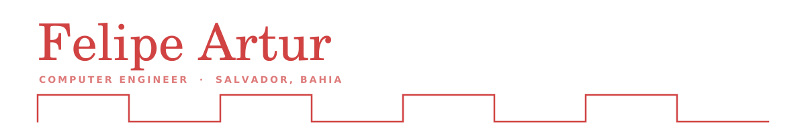

Computer Engineer in Salvador, Brazil. I like products that touch the physical
world: the firmware on the board, the service that collects what it measures,
and the screen where someone finally reads it. Most of the fun is where two of
those meet.

---

### Things I've shipped

Three years at SENAI CIMATEC, 907 commits across 11 projects that made it to
production.

The one I'd show first is the interface of a **medical vacuum system**: 245
commits, LVGL on an STM32H753, and a desktop Qt simulator I wrote so the screen
could be built and tested without ever touching the board.

There's a **power datalogger** that ran two years in the field, reading meters
over Modbus RTU into a cloud time-series database through a disk queue — a
reading only leaves disk after the write comes back confirmed, so a dropped
connection costs nothing. And a **ground station dashboard** for a nanosatellite,
where pulling visual config apart from data mapping deleted ~2,900 duplicated
lines across six screens.

Before any of that I built the first BI dashboard my department had, in Power BI
with DAX written by hand. It got adopted, and someone later built a whole system
on top of it.

### What I reach for

| | |
|---|---|
| **Embedded** | C++17, STM32, FreeRTOS, Zephyr, LVGL, MISRA C++, drivers from datasheets, serial protocols with CRC-16 |
| **Web** | TypeScript, React, Django REST, Flask, PostgreSQL, SQLite, JWT |
| **Data** | SQL by hand, relational modelling, pandas, Power BI and DAX, InfluxDB, TensorFlow, PyTorch |
| **Infrastructure** | Linux, Docker, systemd, embedded Linux on Toradex, shell, CI |

### Things I keep around

**[BrokerShark](https://github.com/FelipeArtur/BrokerShark)** answers one
question — how much can I spend right now — and never leaves my machine. The
financial invariants live as a query the audit runs against the real database,
so the rule sits in one place instead of scattered through the app. Money in
integer cents, no floats anywhere near the ledger.

**[nb2pdf](https://github.com/FelipeArtur/nb2pdf)** turns notebooks and
print-ready HTML into paginated PDF from the terminal, no LaTeX involved. One
file, and it installs nothing into your Python.

**[delivery-sql](https://github.com/FelipeArtur/delivery-sql)** is a delivery app
modelled in 16 tables and written twice, once in Oracle and once in MySQL.
Watching the same model diverge across dialects was half the exercise.

### Also

Coursework from my Computer Engineering degree, VR research prototypes included,
tagged [`senai-cimatec`](https://github.com/search?q=user%3AFelipeArtur+topic%3Asenai-cimatec&type=repositories).
Specializing in Data Science & Analytics through May 2027. Two papers published:
a ground sensor terminal for LoRa CubeSat missions (SpaceLab, UFSC) and virtual
reality with eye tracking in Industry 4.0 (IX SAPCT).
